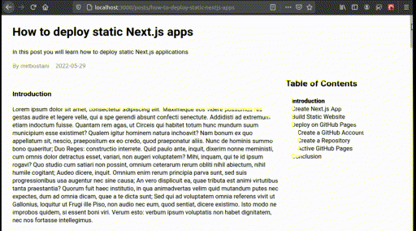

# Next.js Markdown Blog with ToC

A simple markdown blog with an auto-generated table of contents widget on the sidebar, built with Next.js

A full description is available on the following website:

[https://mirbostani.com/create-a-table-of-contents-for-a-nextjs-markdown-blog](https://mirbostani.com/create-a-table-of-contents-for-a-nextjs-markdown-blog)